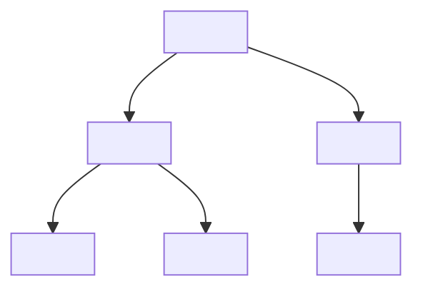
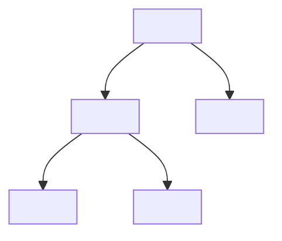

+++
title = "Binary Tree Structure"
date = 2026-02-21T18:39:16+05:45
tags = ["TSA", "binary tree"]
series = ["Tree Structures and Algorithms"]
math = true
description = "Binary Tree Structure"
+++

## Binary Tree Structure

 

A **Binary Tree** is a special case of an N-ary tree where $N = 2$.

Each node can have **at most two children**, commonly referred to as:

- Left child  
- Right child  

 

A **Strict Binary Tree** (also called Full Binary Tree) is a binary tree in which every node has either:

- Degree $0$ (leaf), or  
- Degree $2$  

No node is allowed to have exactly one child.

---

## Number of Binary Trees with Unlabelled Nodes

For a given $n$ nodes, the number of distinct **binary tree structures** is:

$$
T(n) = \frac{1}{n+1} {2n \choose n}
$$

This is the $n^{th}$ [**Catalan number**](https://cp-algorithms.com/combinatorics/catalan-numbers.html).


Among the $T(n)$ possible trees, exactly $2^{n-1}$ trees have maximum height ($h = n - 1$).


---

## Binary Trees with Labelled Nodes

The Catalan number counts only **structures**.

If nodes are labelled, each structure can be arranged in $n!$ ways.

Therefore,

$$
T(n) = \frac{1}{n+1} {2n \choose n} \cdot n!
$$


- Catalan number → counts structures  
- Multiply by $n!$ → counts labelled trees  


---

## Height vs Number of Nodes

Height = number of edges in the longest root-to-leaf path.

---

### Given Height $h$

For a binary tree of height $h$:

- **Minimum nodes** (skewed tree):
  $$
  n_{min} = h + 1
  $$

- **Maximum nodes** (perfect binary tree):
  $$
  n_{max} = 2^{h+1} - 1
  $$

Hence,

$$
h + 1 \leq n \leq 2^{h+1} - 1
$$

---

### Given Number of Nodes $n$

For a binary tree with $n$ nodes:

- **Minimum height** (most balanced case):
  $$
  h_{min} = \left\lceil \log_2(n + 1) \right\rceil - 1
  $$

- **Maximum height** (completely skewed):
  $$
  h_{max} = n - 1
  $$

Thus,

$$
\left\lceil \log_2(n + 1) \right\rceil - 1 \leq h \leq n - 1
$$

---



- Maximum height → tree behaves like a linked list.  
- Minimum height → tree is as balanced as possible.  
- Maximum nodes for height $h$ follow geometric progression:

  $$
  1 + 2 + 4 + \dots + 2^h = 2^{h+1} - 1
  $$


