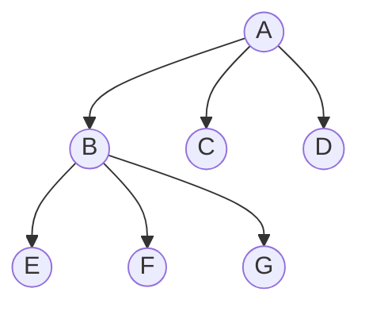

+++
title = "General Tree Structure"
date = 2026-02-21T13:22:01+05:45
tags = ["TSA"]
series = ["Tree Structures and Algorithms"]
math = true
description = "General Tree Structure"
+++

## General Tree Structure

An **N-ary Tree** is a tree in which each node can have at most $N$ children.

A **Strict N-ary Tree** (also called a Full N-ary Tree) is a tree where every node has either:

- Degree $0$ (leaf node), or  
- Degree $N$ (exactly $N$ children)

No node is allowed to have any other number of children.

---

## Analysis of Strict N-ary Tree

In a strict N-ary tree:

- Every internal node has exactly $N$ children.
- Leaves have degree $0$.
- The structure grows in complete branching units.


In a general N-ary tree, nodes may have any number of children from 0 to N.

Because of this flexibility:

- No fixed relation exists between internal and external nodes.
- Exact counting formulas are not possible.
- Only upper and lower bounds can be derived.

Strict N-ary trees impose uniform branching (degree = 0 or N), which allows clean mathematical
relations. Hence, strict trees are easier to analyze and commonly studied.


---

### Given Height $h$

Given height of a strict N-ary tree,  
_what is the minimum #nodes it can have?_  
_what is the maximum #nodes it can have?_

#### Minimum Number of Nodes

To achieve height $h$ with minimum #nodes, we must extend one branch fully.

Since every internal node must have exactly $N$ children:

- Each internal node contributes $N$ children.
- To form height $h$, we need $h$ internal levels.

Minimum nodes:

$$
n_{min} = Nh + 1
$$

---

#### Maximum Number of Nodes

Maximum nodes occur when the tree is perfectly balanced.

Level-wise node count:

$$
1 + N + N^2 + N^3 + \dots + N^h
$$

This is a geometric series.

Using sum formula:

$$
n_{max} = \frac{N^{h+1} - 1}{N - 1}
$$

---

Hence,

$$
Nh + 1 \leq n \leq \frac{N^{h+1} - 1}{N - 1}
$$


- Maximum nodes → fully balanced tree  
- Minimum nodes → single long chain of internal nodes  


---

### Given Number of Nodes $n$

Given #nodes of a strict N-ary tree,  
_what is the minimum height it can have?_  
_what is the maximum height it can have?_

#### Minimum Height

Minimum height occurs when the tree is as balanced as possible (maximum branching).

From:

$$
n = \frac{N^{h+1} - 1}{N - 1}
$$

Solving for $h$:

$$
h_{min} = \left\lceil \log_N(n(N-1) + 1) \right\rceil - 1
$$

---

#### Maximum Height

Maximum height occurs when the tree is as skewed as possible.

Using:

$$
n = Nh + 1
$$

Solving for $h$:

$$
h_{max} = \frac{n - 1}{N}
$$

---

### Relation Between Internal and External Nodes

Let:

- $i$ = number of internal nodes  
- $e$ = number of external (leaf) nodes  

In a strict N-ary tree, each internal node contributes exactly $N$ children.

Total children in tree = $Ni$  
But total nodes except root = $n - 1$

Using tree property:

$$
Ni = n - 1
$$

Since:

$$
n = i + e
$$

Substituting:

$$
Ni = i + e - 1
$$

Solving:

$$
e = (N - 1)i + 1
$$

 

**Example**: Strict 3-ary Tree ($N = 3$)

 

- Internal nodes ($i$) = 2
- Using formula:  
  $$
  e = (N - 1)i + 1 = (3 - 1)\cdot 2 + 1 = 5
  $$

So we should have 5 leaf nodes.


- Number of leaves grows linearly with internal nodes.
- For binary tree ($N = 2$):

  $$
  e = i + 1
  $$

  (Classic property of strict binary tree)

- Strict N-ary trees are highly structured and easier to analyze due to fixed branching.

