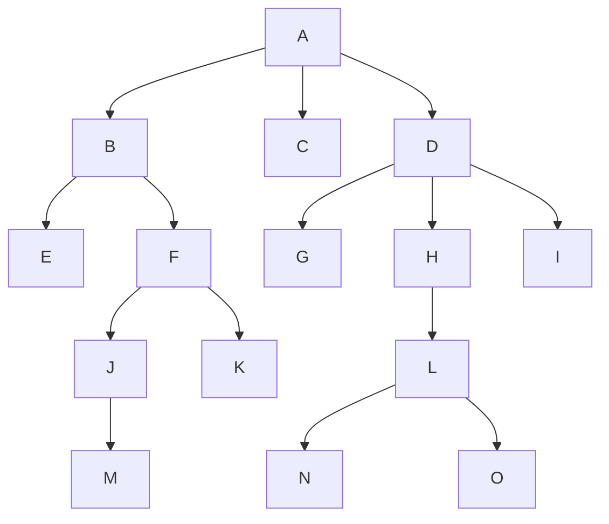

+++
title = "Introduction to Tree Structure"
date = 2026-02-21T11:10:37+05:45
tags = ["TSA"]
math = true
series = ["Tree Structures and Algorithms"]
description = "Introduction to Tree Structure"
+++

# Tree Terminologies

 

- **Root**: A node that has no incoming edge (no parent).  
  Node $A$ is the root of the above tree.

- **Parent**: A node $m$ is the parent of nodes $n_i$ if there are edges from $m$ to each $n_i$.  
  Node $D$ is the parent of nodes $\{G, H, I\}$.

- **Child**: A node $n$ is a child of node $m$ if there is an edge from $m$ to $n$.

- **Siblings**: Nodes $\{n_i\}$ are siblings if they share the same parent node $m$.  
  For example, $\{G, H, I\}$ are siblings.

- **Descendants**: All nodes that can be reached from a given node by following downward edges (recursively).  
  Nodes $\{J, K, M\}$ are descendants of node $F$.

- **Ancestors**: All nodes on the path from a given node to the root (excluding the node itself).  
  For example, ancestors of $M$ are $\{J, F, B, A\}$.

- **Degree of a Node**: The number of children of that node (i.e., number of outgoing edges).  
  Degree of node $D$ is $3$.  
  Degree of a leaf node is $0$.

- **Degree of a Tree**: The maximum number of children any node can have in a tree.  
  Binary Tree has degree $2$ (i.e., each node in the tree has degree $\leq 2$).

- **Internal Node**: A node with at least one child (degree $\geq 1$).  
  Nodes $\{A, B, D, F, H, J, L\}$ are internal nodes.

- **External Node (Leaf Node)**: A node with no children (degree $0$).  
  Nodes $\{C, E, G, I, K, M, N, O\}$ are leaf nodes.

- **Level**: The level of a node is defined as the number of edges from the root to that node.  
  Root is at level $0$.  
  Node $F$ is at level $2$.  
  Node $M$ is at level $4$.

- **Height of a Node**: The number of edges in the longest downward path from that node to a leaf.  
  Height of node $F$ is $2$ (path: $F \to J \to M$).

- **Height of a Tree**: The height of the root node.  
  Height of the above tree is $4$.

- **Forest**: A collection of disjoint trees.  
  If the root $A$ is removed, the remaining structure forms a forest of three trees rooted at $\{B, C, D\}$.
